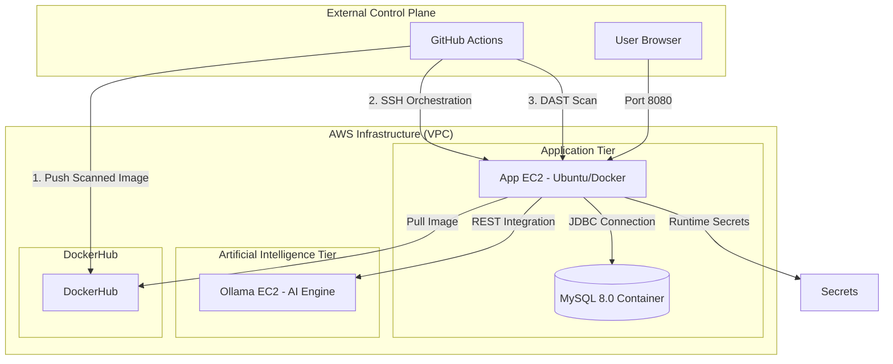
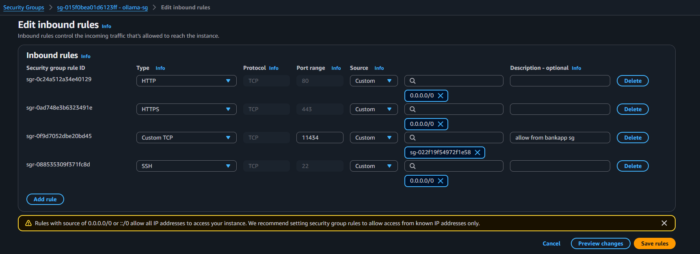
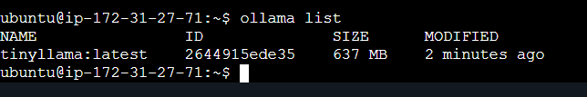
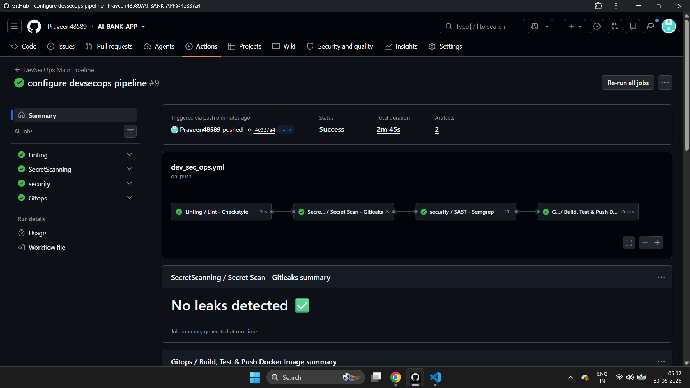
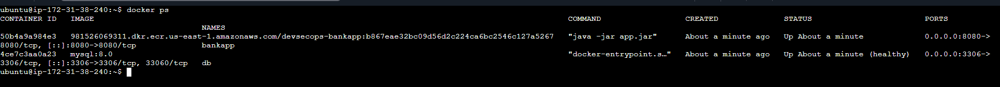
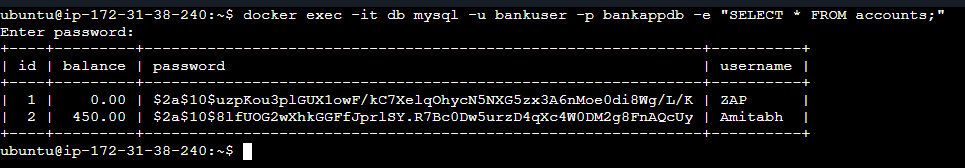
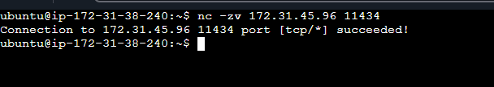

<div align="center">

# DevSecOps Banking Application

A high-performance, containerized financial platform built with Spring Boot 3, Java 21, and integrated Contextual AI. This project implements a secure "DevSecOps Pipeline" using GitHub Actions, OIDC authentication, and AWS managed services.

[](https://www.oracle.com/java/technologies/javase/jdk21-archive-downloads.html)
[](https://spring.io/projects/spring-boot)
[](.github/workflows/devsecops.yml)
[](#phase-3-security-and-identity-configuration)

</div>


---

## Technical Architecture

The application is deployed across a multi-tier, segmented AWS environment. The control plane leverages GitHub Actions with integrated security gates at every stage.



---

## Security Pipeline (DevSecOps Pipeline)

The CI/CD pipeline enforces **9 sequential security gates** before any code reaches production:

| Gate | Name | Tool | Purpose |
| :---: | :--- | :--- | :--- |
| 1 | Secret Scan | Gitleaks | Scans entire Git history for leaked secrets |
| 2 | Lint | Checkstyle | Enforces Java Google-Style coding standards |
| 3 | SAST | Semgrep | Scans Java source code for security flaws and OWASP Top 10 |
| 4 | SCA | OWASP Dependency Check (first time run can take more than 30+ minutes) | Scans Maven dependencies for known CVEs |
| 5 | Build | Maven | Compiles and packages the application |
| 6 | Container Scan | Trivy | Scans the Docker image for OS and library vulnerabilities |
| 7 | Push | DockerHub | Pushes the image only after Trivy passes |
| 8 | Deploy | SSH / Docker Compose | Automated deployment to AWS EC2 |
| 9 | DAST | OWASP ZAP | Dynamic attack surface scanning on live app |

---

## Technology Stack

- **Backend Framework**: Java 21, Spring Boot 3.4.1
- **Security Strategy**: Spring Security, IAM OIDC, Secrets Manager
- **Persistence Layer**: MySQL 8.0 (Docker Container)
- **AI Integration**: Ollama (TinyLlama)
- **DevOps Tooling**: Docker, Docker Compose, GitHub Actions, AWS CLI, jq
- **Infrastructure**: Amazon EC2, Amazon ECR, Amazon VPC

---

## Implementation Phases

### Phase 1: AWS Infrastructure Initialization

1. **Application Server (EC2)**:

   - Deploy an Ubuntu 22.04 instance with below `User Data`.

      ```bash
      #!/bin/bash

      sudo apt update 
      sudo apt install -y docker.io docker-compose-v2 jq
      sudo usermod -aG docker ubuntu
      sudo newgrp docker
      sudo snap install aws-cli --classic
      ```

   - Configure Security Group to open inbound rule for Port 22 (Management) and Port 8080 (Service).

      > Better to give `name` to Security Group created.

2. **AI Engine Tier (Ollama)**:
   - Deploy a dedicated Ubuntu EC2 instance.
   - Open Inbound Port `11434` from the Application EC2 Security Group.

      > Better to give `name` to Security Group created.
    
      

   - Automate initialization using the [ollama-setup.sh](scripts/ollama-setup.sh) script via EC2 User Data.
    
      

   - Verify the AI engine is responsive and the model is pulled in `AI engine EC2`:

     ```bash
     ollama list
     ```

      

---

### Phase 2: Secrets and Pipeline Configuration

#### 1. AWS Secrets Manager
Create a secret named `bankapp/prod-secrets` in `Other type of secret` with the following key-value pairs:

| Secret Key | Description | Sample/Default Value |
| :--- | :--- | :--- |
| `DB_HOST` | The MySQL container service name | `mysql-service` |
| `DB_PORT` | The database port | `3306` |
| `DB_NAME` | The application database name | `bankappdb` |
| `DB_USER` | The database username | `root` |
| `DB_PASSWORD` | The database password | `Test@123` |
| `OLLAMA_URL` | The private URL for the AI tier | `http://<PRIVATE-IP>:11434` |


#### 2. GitHub Repository Secrets
Configure the following Action Secrets within your GitHub repository settings:

| Secret Name | Description |
| :--- | :--- |
| `EC2_HOST` | The public IP address of the Application EC2 |
| `EC2_USER` | The SSH username (default is `ubuntu`) |
| `EC2_SSH_KEY` | The content of your private SSH key (`.pem` file) |

## Continuous Integration and Deployment

The DevSecOps lifecycle is orchestrated through the [DevSecOps Main Pipeline](.github/workflows/devsecops-main.yml), which securely sequences three modular workflows: [CI](.github/workflows/ci.yml), [Build](.github/workflows/build.yml), and [CD](.github/workflows/cd.yml). Together they enforce **9 sequential security gates** before any code reaches production. Every `git push` to the `main` or `devsecops` branch triggers the full pipeline automatically.

| Gate | Job | Tool | Action |
| :---: | :--- | :--- | :--- |
| 1 | `gitleaks` | Gitleaks | **Strict**: Fails if any secrets are found in history. |
| 2 | `lint` | Checkstyle | **Audit**: Reports style violations but doesn't block (Google Style). |
| 3 | `sast` | Semgrep | **Strict**: Scans code for vulnerabilities. Fails on findings. |
| 4 | `sca` | OWASP Dependency Check | **Strict**: Fails if any dependency has CVSS > 7.0. |
| 5 | `build` | Maven | Standard build and test stage. |
| 6 | `image_scan` | Trivy | **Strict**: Scans Docker image layers. Fails on any High/Critical CVE. |
| 7 | `push_to_dockerhub` | DockerHub | Pushes the verified image to DockerHub. |
| 8 | `deploy` | SSH / Docker Compose | Fetches secrets from AWS Secrets Manager and recreates the container. |
| 9 | `dast` | OWASP ZAP | **Audit Mode**: Comprehensive scan that reports findings as artifacts, but does not block the pipeline. |

All scan reports (OWASP, Trivy, ZAP) are uploaded as downloadable **Artifacts** in each GitHub Actions run, YOu can look into the **Artifacts**.

- CI/CD

   

## Operational Verification

- **Process Status**: `docker ps`

  

- **Application Working**:

  

- **Database Connectivity**: 

  ```bash
  docker exec -it db mysql -u <USER> -p bankappdb -e "SELECT * FROM accounts;"
  ```

  

  > **ZAP** is automatically created by **DAST - OWASP ZAP Baseline Scan** job in [cd.yml](.github/workflows/cd.yml). Read more about it(How, Why it does) on google...

- **Network Validation**: 

  ```bash
  nc -zv <OLLAMA-PRIVATE-IP> 11434
  ```

  

---

<div align="center">

Happy Learning

**Praveen Tomar**  

</div>
